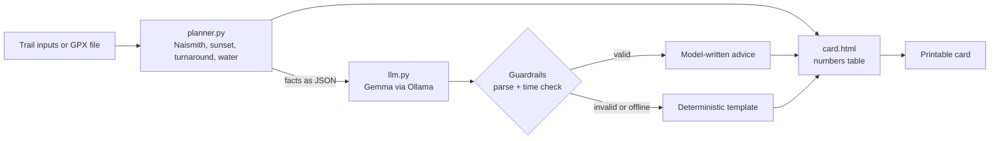

# 🥾 TrailCard

**Plan the trail day on a screen, then put the screen away.**

TrailCard is an offline trail-day planner. You describe a hike (distance, climb, start time, location, or upload a GPX file) and it produces a **one-page printable trail card**: when to start, when to turn back, when the sun sets, how much water to carry, and plain-language advice written by an **open-weight Gemma model running locally through [Ollama](https://ollama.com)**.

Print the card or save it to your phone, switch to airplane mode, and go outside. The screen is the shortest part of the experience.

> Built for the [Hacktoberfest Open-Source AI Challenge, Week 1: Touch Grass](https://dev.to/challenges/hacktoberfest-week1-2026-10-05).

## Why it works with no signal

| Part | How it works | Needs internet? |
| --- | --- | --- |
| Walking time, turnaround, water | Plain Python ([`planner.py`](planner.py)) using Naismith's rule | No |
| Sunrise and sunset | [`astral`](https://github.com/sffjunkie/astral), computed from latitude, longitude and date | No |
| GPX distance and climb | [`gpxpy`](https://github.com/tkrajina/gpxpy), parsed locally | No |
| Advice text | Local Gemma model via Ollama | No (after the one-time model download) |
| Card layout | Jinja2 HTML template with print CSS | No |

Your trail location never leaves your machine.

## Example output

[`examples/sample-card.html`](examples/sample-card.html) is a card generated from the synthetic [`examples/sample.gpx`](examples/sample.gpx). It was produced with the built-in template (no AI model), which is also what you get if Ollama is not running. Download the file and open it in a browser to see the layout.

## Quick start

You need Python 3.10 or newer and [Ollama](https://ollama.com/download).

```bash
git clone https://github.com/Aakif-Kohari/trailcard.git
cd trailcard

python -m venv .venv
source .venv/bin/activate        # Windows: .venv\Scripts\activate
pip install -r requirements.txt

ollama pull gemma3               # one-time download (the default gemma3 tag is the 4B model)
streamlit run app.py
```

Then:

1. Enter the trail name, date, start time, group size, route type, location and UTC offset.
2. Enter distance and climb, **or** upload a GPX file (it overrides the typed numbers).
3. Click **Plan my trail day**.
4. Click **Download card**, open the file, and use **Print / save as PDF**.

No GPU is required for the 4B model on a modern laptop, but generation is slower on older CPUs. Smaller or larger Gemma variants also work: the sidebar lists every model installed in your Ollama, and you can force one with the `TRAILCARD_MODEL` environment variable (for example `TRAILCARD_MODEL=gemma3:1b`).

If Ollama is not running, TrailCard still works and uses a built-in template for the advice text.

## How it works



**The model never does the maths.** `planner.py` computes every number. The model receives them as JSON and only writes the advice. Two guardrails keep it honest:

1. **Time check.** Any clock time in the model's answer that does not appear in the plan is treated as invented, and the card falls back to the template.
2. **Structure check.** The answer is parsed into the six card sections. Missing sections are filled from the template, and unreadable answers fall back entirely.

The table of numbers at the top of the card always comes from `planner.py`, so it stays correct even when the model is wrong. See [`docs/DESIGN.md`](docs/DESIGN.md) for the reasoning and the limitations.

### The safety rule

- **Walking time** = 5 km/h plus 1 minute per 10 m of ascent (Naismith's rule), plus your planned breaks.
- **Target finish** = sunset minus 1 hour.
- **Hard turnaround time** = target finish minus half the total time. If you have not reached the far end (out-and-back) or the halfway point (loop) by then, turn back or shorten the route.
- **Latest safe start** = target finish minus total time.

## Project layout

```text
trailcard/
├── app.py              # Streamlit UI
├── planner.py          # Deterministic planning maths (no AI)
├── llm.py              # Ollama/Gemma call, parsing, guardrails, template fallback
├── gpx_utils.py        # GPX distance and noise-filtered elevation gain
├── render.py           # Jinja2 rendering of the printable card
├── templates/card.html # Print-friendly A4 card
├── examples/           # Synthetic sample GPX and a sample card
├── docs/DESIGN.md      # Design decisions and limitations
└── tests/              # pytest suite
```

## Tests

```bash
pip install -r requirements-dev.txt
pytest
```

The suite covers the planning maths, GPX parsing, the card renderer, the model guardrails and an end-to-end run of the Streamlit app. The Ollama calls are **mocked** in the tests, so the suite runs without Ollama installed. Real model output varies, which is exactly why the guardrails exist.

## Configuration

| Setting | Where | Default |
| --- | --- | --- |
| Model | Sidebar, or `TRAILCARD_MODEL` env var | First installed Gemma, else `gemma3` |
| Planned breaks | Form | 30 minutes |
| Emergency number | Form | `112` (works on most mobile networks) |

## Limitations

- **Advisory only.** TrailCard is not a substitute for navigation skills, weather forecasts, local regulations or trail closures.
- Naismith's rule is a rough guide. It ignores terrain, fitness, load and weather.
- You enter the **UTC offset** yourself. Sun times are computed for the location and shown in that offset, so a wrong offset gives wrong clock times.
- Polar day and night are not supported, because there is no usable sunset.
- The guardrails check clock times, not every number. Always trust the table at the top of the card over the model's prose.

## Contributing

Issues and pull requests are welcome. Please run `pytest` before opening a PR.

## License

[MIT](LICENSE)
